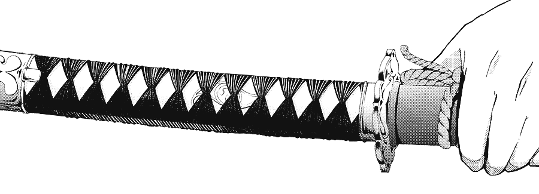

# Katana

A light and efficient tensor library for Zig with a focus on simplicity and ease of use.

> **Note**: Katana is currently under pre-release (v0.1.0)! We are looking for feedback to improve features and solve bugs. Please contribute [here](CONTRIBUTING.md)!

## Installation

### Prerequisites

> **Important**: This library currently only works with Zig version 0.13.0. Support for the upcoming 0.14.0 version is planned when it is released in February 2025.

Required:
- Zig compiler version 0.13.0
- Git (optional, for cloning the repository)

If you're using a different Zig version, you may encounter compatibility issues.

### Adding the Library to Your Project

There are two ways to add Katana to your project:

#### Method 1: Using `zig fetch`

1. Ensure you have a `build.zig.zon` file in your project root.
2. Run the following command:
   ```bash
   zig fetch --save https://github.com/snowclipsed/katana/archive/refs/tags/<version>.tar.gz
   ```

##### Example: Installing Version 0.1.0

To install version 0.1.0 of Katana, use the following command:

```bash
zig fetch --save https://github.com/snowclipsed/katana/archive/refs/tags/v0.1.0.tar.gz
```

#### Method 2: Using Git
1. Clone the repository
2. Run:
   ```bash
   git clone https://github.com/snowclipsed/katana
   ```

Now, your build.zig.zon might look something like this:

```zig
.{
    .name = "test-tensor",

    .version = "0.0.0",

    .dependencies = .{
        .katana = .{
            .url = "../katana",
            .hash = "122099ca4b8c1e2b85203e73491785f91b8c585729a60d6c81b3201fcaaefe9b692c",
        },
    },
    .paths = .{
        "build.zig",
        "build.zig.zon",
        "src",
    },
}

```


### Configuring Your Build

Add Katana as a dependency in your `build.zig` file. Here's a complete example:

```zig
const std = @import("std");

pub fn build(b: *std.Build) void {
    const target = b.standardTargetOptions(.{});
    const optimize = b.standardOptimizeOption(.{});

    // load the "katana" dependency from build.zig.zon
    const package = b.dependency("katana", .{
        .target = target,
        .optimize = optimize,
    });

    const module = package.module("katana");

    const exe = b.addExecutable(.{
        .name = "test-tensor",
        .root_source_file = b.path("src/main.zig"),
        .target = target,
        .optimize = optimize,
    });

    b.installArtifact(exe);
    // add the "katana" dependency to the root module
    exe.root_module.addImport("katana", module);

    const run_cmd = b.addRunArtifact(exe);

    run_cmd.step.dependOn(b.getInstallStep());

    if (b.args) |args| {
        run_cmd.addArgs(args);
    }

    const run_step = b.step("run", "Run the app");
    run_step.dependOn(&run_cmd.step);
}
```

#### Build File Explanation

- The build file sets up a standard Zig executable project
- It loads the `katana` package using `b.dependency("katana", ...)`
- The package is added as a module that can be imported in your code
- The executable is configured with the Katana module as a dependency
- A run step is added for convenience

## Usage

Here's a basic example showing how to use Katana to do matrix multiplication:

```zig
const std = @import("std");
const k = @import("katana");
const tensor = k.Tensor;
const ops = k.ops;

pub fn main() !void {
    var gpa = std.heap.GeneralPurposeAllocator(.{}){};
    defer _ = gpa.deinit();
    const allocator = gpa.allocator();

    // Create tensors
    var a = try tensor(f32).init(allocator, &[_]usize{ 2, 3 });
    defer a.deinit();
    var b = try tensor(f32).init(allocator, &[_]usize{ 3, 2 });
    defer b.deinit();

    // matrix multiplication
    var c = try ops.matmul(f32, a, b, allocator);
    defer c.deinit();

    c.print2D();
}

```

## License

This project is licensed under the Apache License, Version 2.0 - see the [LICENSE](LICENSE) file for details.

```
Copyright 2024 Katana Contributors

Licensed under the Apache License, Version 2.0 (the "License");
you may not use this file except in compliance with the License.
You may obtain a copy of the License at

    http://www.apache.org/licenses/LICENSE-2.0

Unless required by applicable law or agreed to in writing, software
distributed under the License is distributed on an "AS IS" BASIS,
WITHOUT WARRANTIES OR CONDITIONS OF ANY KIND, either express or implied.
See the License for the specific language governing permissions and
limitations under the License.
```

## Contributing

We welcome contributions to Katana! Please see our [Contributing Guidelines](CONTRIBUTING.md) for details on how to submit changes, coding standards, testing requirements, and more.

---

## TODO
- Full SIMD Ops Set (soon!)
- Autograd capability/Graph Compiler
- Extended usage guide
- More ML Ops and tests
- CUDA/GPU support

## List of ops to be added soon:
- Reduction operations : sum, mean, max/min, prod, argmin, any/all
- Element-wise operations : pow, exp, log/log2/log10, sqrt, sign, round/floor/ceil, clip/clamp
- Statistical operations : standard deviation, variance, percentile, covariance matrix support, correlation matrix support
- Linear Algebra operations : matrix trace, determinant, inverse, eigenvalues/vectors, SVD, QR comp, matrix/vector norm
- Advanced math/ML : multidim conv, pool, pad, roll, repeat, gather/scatter
